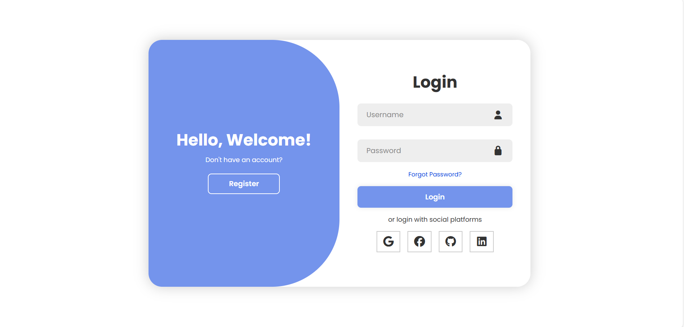
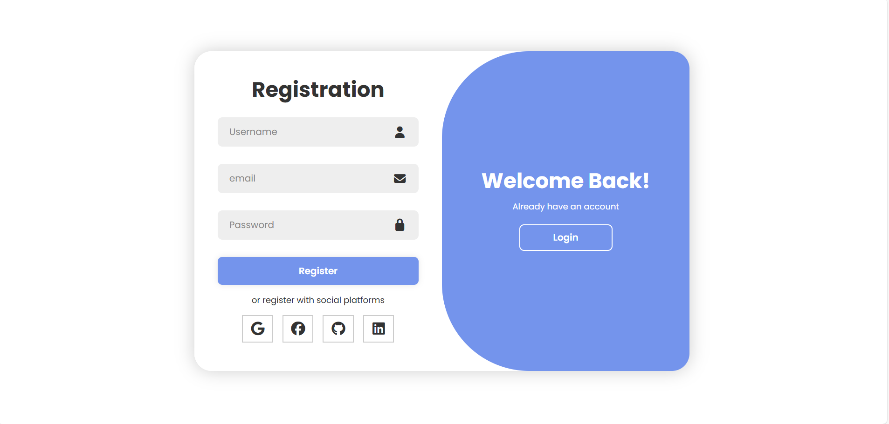

# 🚀 Animated Login / Register Page

An animated login and register page built with HTML, CSS and JavaScript.
The project focuses on smooth UI transitions and user experience.

## Preview

## Demo
   👉 [Demo](https://le-prince-fouda.github.io/Projets-HTML-CSS/Login_register_page/animated_loginRegisterPage1/)

## Features

- Animated transition between login and register forms
- Smooth CSS transitions and transform effects
- Toggle system using JavaScript
- Responsive layout
- Clean and modern UI

## Technologies

- HTML5
- CSS3 (Flexbox, transitions, pseudo-elements)
- JavaScript (DOM manipulation, event handling)

## What I learned

- How to create complex UI animations using CSS transitions
- Using pseudo-elements (::before) for animated backgrounds
- Managing UI state with JavaScript and CSS classes
- Synchronizing animations with transition-delay
- Structuring small front-end projects properly

## Possible improvements

- Add real authentication logic (backend)
- Improve accessibility (ARIA, keyboard navigation)
- Add form validation
- Convert to React component

## Credits

UI concept inspired by a tutorial from YouTube.
Implementation and code written by me for learning purposes.
